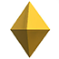

# Primitivnist

A simple toy dataset generator for my experiments on various Ideas and papers, Including Hinton's Capsule networks. You can download `.npy` file of 200000 generated images from my [here](https://drive.google.com/file/d/1Em-WGEO8u2VgXhy1g5hhQuK2bytooDGK/view?usp=sharing)

# Dataset Privew

  

# List of Objects

| Shape Image                                                      |  Shape Name  |
:-----------------------------------------------------------------:|:------------:|
|                  | Box         |
|               | Sphere      |
|             | Cylinder    |
|              | Capsule     |
|                | Torus       |
|              | Pyramid     |
|              | Diamond     |
|                | Wedge       |
|           | ICO-Sphere  |
|                 | Cone        |

## TODO

Integrate with [Google's Poly API](https://developers.google.com/poly/develop/unity) to increase the number of shapes and objects.

