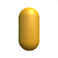

# Primitivnist

A Toy dataset for my own expriments on Hinton's Capsule networks.

# Dataset Privew

  

# List of Objects

| Shape Image                                                      |  Shape Name  |
:-----------------------------------------------------------------:|:------------:|
|                  | Box         |
|               | Sphere      |
|             | Cylinder    |
|              | Capsule     |
|                | Torus       |
|              | Pyramid     |
|              | Diamond     |
|                | Wedge       |
|           | ICO-Sphere  |
|                 | Cone        |